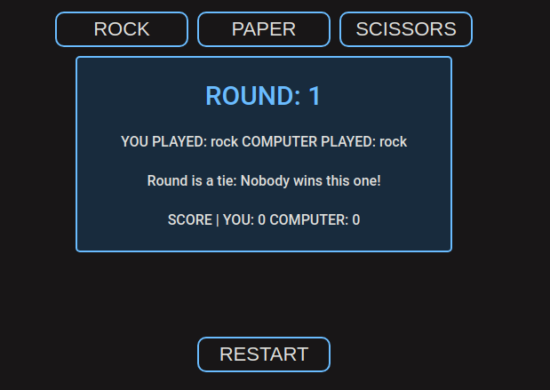
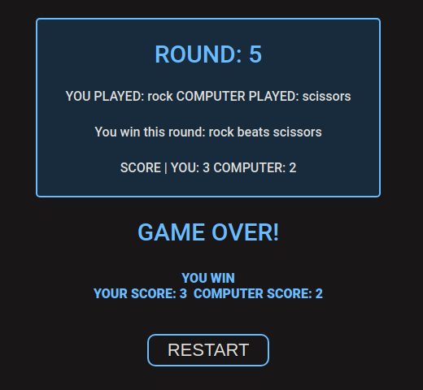

# odin-rock-paper-scissors

This project focuses on building the core logic for a 'Rock, Paper, Scissors' game with JavaScript.

Its main purpose is as a training project to get comfortable with JavaScript programming working with functions, variables & conditional logic and to practice problem-solving techniques in programming.

 
<h3>LIVE PREVIEW:</h3>https://jvben76.github.io/odin-rock-paper-scissors/

 

> 
>
># How to play:
> 
> 
> - Clicking on this <a href = "https://jvben76.github.io/odin-rock-paper-scissors/">link</a> or the live-preview link above will open 'rock-paper-scissors' in your browser. Click on the start button to begin playing
> - After clicking start, click on one of the three buttons being displayed labelled 'rock', 'paper' or 'scissors' respectively to play the first round, click on one of these buttons to play a new round
> - A box will pop up showing the round/game status: round winner, computer & player scores, moves played, round number and if 5 rounds have been played will display an end-game status box with the final score and game winner
> - Click on the restart button below the round-status box to reset the game, then click the start button to play again.
> - <h3>Game Rules:</h3> Rock beats scissors, paper beats rock and scissors beats paper. 1 point is added to the score of whoever wins the round. Winner is determined according to the highest score by the end of the five rounds. No point is awarded if round is a tie, and there is no winner if game is a tie.
>    
>    
>  

>  
>
> # Example of game round UI: 
>
>
>
> 
>
> 
>
> 
> 
>
>
> 
> 

> 
>
>  # Example of end-game UI
> 
>
>
>
> 
> 
>
>  
>  

 

> 
>
> # Learner Section: skills learned
> 
>
> - Working with functions
> - Working with scope: functional & global scope
> - working with variables: let & const
> - working with conditionals & fallback logic
> - working with inputs and dynamic outputs
>
> 
>

